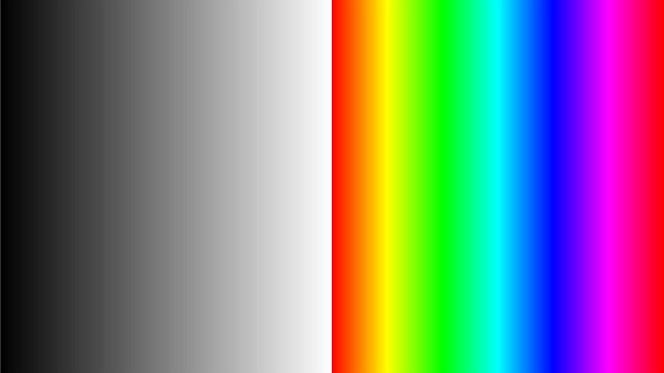
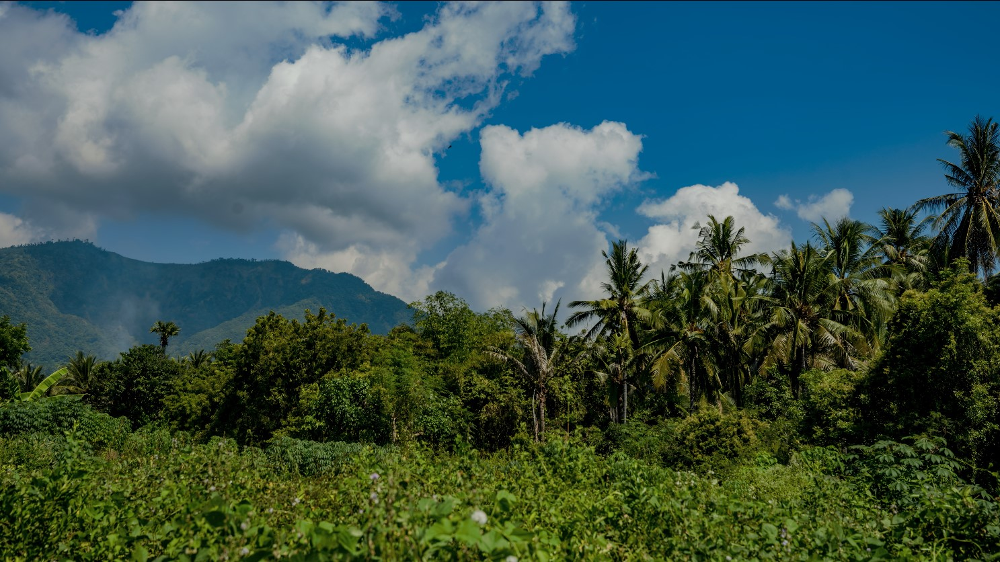
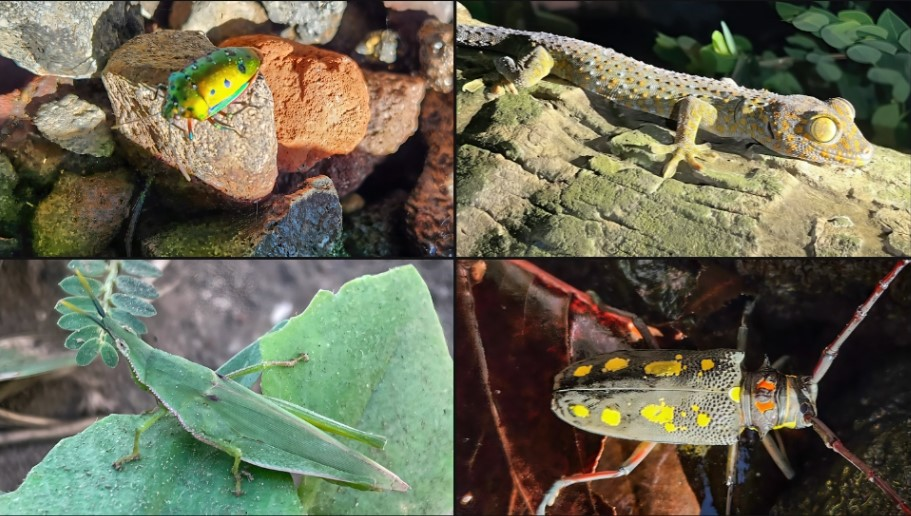
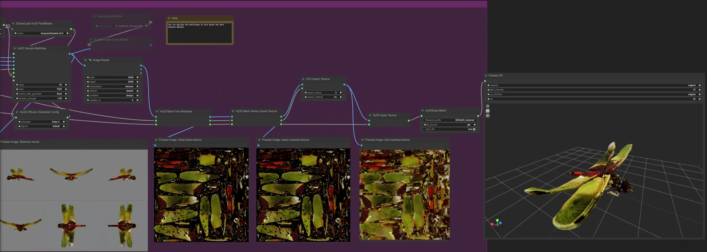

# Dinacon Bali 2025 Master Index

Welcome to the archive and documentation hub for the projects created by [Vincent Naples (@drmbt)](https://www.drmbt.com) in the Les fishing village during the [Dinacon Bali 2025](https://2025.dinacon.org/) conference and art residency.

## About
This site serves as a landing page for all related projects, including documentation, code written and employed, essays and documentation on the process and a column written for the Dinachron newsletter. It is still a WIP as I document these projects.

Feedback or questions about any project or process is welcomed via a [GitHub issue report](https://github.com/drmbt/dinacon-index/issues), or email to [vincent@drmbt.com](mailto:vincent@drmbt.com)

## 🚀 Live Site
Visit the live site: [https://drmbt.github.io/dinacon-index](https://drmbt.github.io/dinacon-index)

## 🛠️ Local Development

This site is built with Jekyll and deployed via GitHub Pages. To run it locally:

### Prerequisites
- Ruby 3.2 or higher
- Bundler

### Setup
1. Clone the repository:
   ```bash
   git clone https://github.com/drmbt/dinacon-index.git
   cd dinacon-index
   ```

2. Install dependencies:
   ```bash
   bundle install
   ```

3. Start the local server:
   ```bash
   bundle exec jekyll serve
   ```

4. Open your browser and visit `http://localhost:4000`

### Build for Production
```bash
bundle exec jekyll build
```

## 🎨 Features

- **Dark Mode Design**: Modern dark theme with beautiful typography
- **Responsive Layout**: Works perfectly on desktop, tablet, and mobile
- **Project Cards**: Beautiful grid layout for showcasing projects
- **Documentation Pages**: Dedicated pages for essays and documentation
- **GitHub Integration**: Direct links to repository and issue reporting
- **SEO Optimized**: Proper meta tags and Open Graph support

## 📁 Project Structure

```
dinacon-index/
├── _config.yml          # Jekyll configuration
├── _layouts/            # Page layouts
│   ├── default.html     # Main layout with dark mode
│   └── page.html        # Individual page layout
├── assets/
│   └── css/
│       └── style.css    # Dark mode styles
├── docs/                # Documentation pages
├── thumbnails/          # Project thumbnails
├── index.md             # Homepage content
└── 404.html            # Custom error page
```

## 🎯 Projects

### [Texture Library](https://photos.app.goo.gl/zmqjz56mBvRjYoAZ6)  
  _A curated photo gallery of decontextualized textures collected in Bali._  
    

### [Texture Cache](https://photos.app.goo.gl/5fgeBVUMi9ySxDxv9)  
  _A video collage project using the Texture Library as a lookup table._

    
    

  This method leverages TouchDesigner's texture3d and time machine operators to recall individual pixels from a cached texture array that are looked up via the luminance of an incoming key input video feed. For this project, I'm caching the above texture library shot in Les Bali to reconstitute images captured by myself, other dinacon attendees, and curated from submissions to the iNaturalist API during this residency.

  I wrote a custom shader that encodes luminance data for "low saturation" pixels into the 0.0 - 0.5 value pixel range of a grey scale key image, and ROYGBIV color sorted information into the 0.5 - 1.0 range of a luminance map to create compositions that depict local life, flora and fauna as painterly collages reconstituted from the decaying textures photographed during this trip.

  More about the technique and philosophy of this practice can be found via link, or the 4th installment of the 2025 Dinachron Newsletter in the essay ["On Textures and Time"](./docs/On-Textures-and-Time.md), written while camera-sitting a timelapse session

### [Time Lapse Bali](./Time-Lapse-Bali/)  
    

  [Raw Timelapse exports shot during dinacon bali 2025](https://photos.app.goo.gl/9DSYiJyWBQaMnbCb9)  

### [Time Cache Bali](./Time-Cache-Bali/)    
  _A non-linear collage project that consists of anachronistic time dilated gradient compositions made from static timelapse image sequences and greyscale procedurally generated feedback loop luminance maps._ 

### [iNaturalist Downloader](https://github.com/drmbt/iNaturalist-downloader)    
  _A script and CLI tool for querying and downloading images and information from the iNaturalist API._

  This script allowed me to pull locally sourced images of the flora and fauna found around Les fishing village, sort them by kingdom and attribution, and manually curate images for use in the texture cache project.

### [iNaturalist Image Selects](https://photos.app.goo.gl/2sU4z2tfgWMhbDni6)  
  _curated and processed images pulled from a time-gated query of the iNaturalist API localiseed within 8km of Les fishing village during dinacon, and used in the Texture Cache project_
  
  After curating images that would read well in landscape orientation and were of a relatively high original resolution, I processed them through lightroom for cropping, reorienting and color balancing, and then ran them through Topaz Gigapixel AI (decidedly not open source) as its the only process I'm aware of that will not just upscale an image, but increase its bit depth from 8 to 16. This is important for the texture caching process, as 8 bit compression artifacts, particularly from web scaled .jpg images create awful artifacting when used in my texture cache workflow

  Although an AI upscaler by nature introduces some amount of hallucination, I'm not concerned in this case as their primary use is for shape, since they will be looked up anyhow and reconstituted using the hi resolution textures captured in my library 

  

### Dinacon 2025 Photography  

  _Not all of the photography I took during this trip was useful as raw assets for art making._  

  Below are album's that tell the story of my time at dinacon, curated images of life in Les fishing village Bali  

  [Dinacon Bali 2025 Story Selects](https://photos.app.goo.gl/xhbz6ERDyrVhF7Vd6)

  [Plant Olympics](https://photos.app.goo.gl/HKRcKAJaw3vcxCg67)  

  [Texture Library](https://photos.app.goo.gl/zmqjz56mBvRjYoAZ6) (same as above)

### 3D Model From Single Image AI
  _as a part of the 3d modeling cohort, I experimented with leveraging open source AI models to create 3d meshes_

    

  This process leverages [ComfyUI](https://www.comfy.org/) open source local AI inference interface and the open weights [Hunyuan3d v2](https://hunyuan-3d.com/) model to create 3D models generated from single perspective photographs when video or multi perspective photogrametry data sets were unavailable. Although imperfect, I was impressed at how well the models turned out.

  The collection can be accessed [here](https://drive.google.com/drive/folders/1MnnwmTJcS1NHYoNZ0laKhD3mYq3bygjI?usp=sharing)

---

## Featured Writing

### Essay: On Texture and Time
[Read the essay](./docs/On-Textures.md)

### "Chron Jobs" Dinachron Newsletter Zine Column
[Read Chron Jobs](./docs/Chron-Jobs.md)

---

## 🤝 Contributing

1. Fork the repository
2. Create a feature branch (`git checkout -b feature/amazing-feature`)
3. Commit your changes (`git commit -m 'Add some amazing feature'`)
4. Push to the branch (`git push origin feature/amazing-feature`)
5. Open a Pull Request

## 📄 License

This project is open source and available under the [MIT License](LICENSE).

---

<div align="center">
  <p>Built with ❤️ using Jekyll and GitHub Pages</p>
  <p><a href="https://github.com/drmbt/dinacon-index" target="_blank" rel="noopener">View on GitHub</a></p>
</div>

